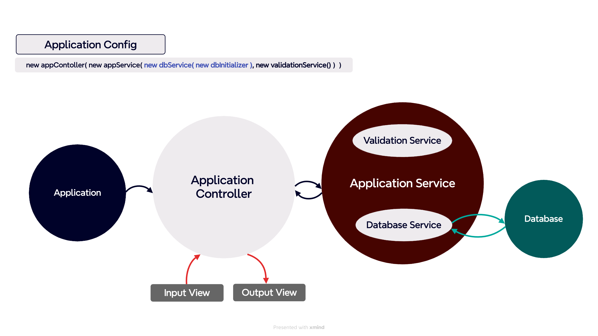

# ⚜️ 프로젝트명
편의점: 결제 시스템 개발

# ⚜️ 기능 개요 및 흐름도
- 할인 혜택, 재고 상황에 대한 정보를 resources 폴더 하위의 products.md, promotions.md 파일에서 읽어와 DB에 저장
- 입력
  - 구매 상품 및 수량 입력( [상품명1-수량],[상품명2-수량], ... )
  - 프로모션 적용 가능 + 고객이 해당 수량보다 적게 가져온 경우 : 추가 여부 입력( Y/N )
  - 프로모션 재고 부족( 일부 수량을 프로모션 없이 결제해야 함 ): 일부 수량을 정가로 결제할지 여부 입력( Y/N )
  - 멤버십 할인 적용 여부 입력( Y/N )
  - 추가 구매 여부( Y/N )
  - 프로모션 적용 상품의 경우, N개를 더 가져오면 1개를 무료로 더 가져올 수 있음 안내 ⬅︎ 임의로 추가한 기능 
- 출력
    - 초기 화면( 환영 인사, 상품명/가격/프로모션/재고 안내: 재고가 없다면 `재고 없음` 출력 )
    - 영수증( 구매 상품 내역, 증정 상품 내역, 금액 정보 )
  

# ⚜️ 예외 처리
## [ 파일 읽기 + 정보 반환 ]
- [x] resource 패키지 내부에 있는 파일이 아닌 경우 ⬅︎ 임의로 추가한 기능
- [x] 파일 이름이 잘못 입력되었을 경우 ⬅︎ 임의로 추가한 기능 

## [ 파일 데이터 DB에 초기 세팅 ]
- [x] 파일 속 데이터가 잘못 입력되어 있는 경우( ex. 상품 가격을 저장하는 곳에 문자가 입력되어 있는 경우 ) ⬅︎ 임의로 추가한 기능 

## [ 입력 ]
- [ ] 구매 상품/수량 형식이 올바르지 않을 경우( `[ERROR] 올바르지 않은 형식으로 입력했습니다. 다시 입력해 주세요.` )
  - 대괄호( [, ] ), 쉼표(,), 하이픈(-) 등 입력 요구사항을 정확히 지켜야 정상적으로 작동 ⬅︎ 임의로 지정한 제한
- [ ] 존재하지 않는 상품을 입력한 경우( `[ERROR] 존재하지 않는 상품입니다. 다시 입력해 주세요.` )
- [ ] 구매 수량이 재고 수량을 초과한 경우( `[ERROR] 재고 수량을 초과하여 구매할 수 없습니다. 다시 입력해 주세요.` )
- [ ] 기타 잘못된 입력( `[ERROR] 잘못된 입력입니다. 다시 입력해 주세요.` )
  - Y/N 가 아닌 다른 문자 입력한 경우
  - 공백을 입력한 경우

# ⚜️ 기능 목록
### 상세 기능 및 작동 순서
## [ 파일 읽기 + 정보 반환 ]
- [x] 할인 혜택 정보, 재고 상황 정보를 불러오는 메서드를 나누어 작성한다.
- [x] 파일의 경로를 enum 객체를 활용해 얻는다.
- [x] 첫 번째 줄은 헤더이므로 삭제한다.
- [x] 정보를 행 단위로 읽어 List<String> 형태로 저장해 반환한다.

## [ 파일 데이터 DB에 초기 세팅 ]
- [x] config 패키지 하위에 DataInitialSetUp 클래스를 만들고, FileReader를 통해 읽어온 데이터를 products, promotions 각각 나누어 파싱하는 메서드를 만든다.
- [x] 파싱한 정보는 줄 단위로 각각 Product, Promotion 객체로 만든다.
- [x] 상품의 전체 정보를 담고 있는(만들어진 객체를 모두 모아 리스트 형태로 저장) ProductsRepository, PromotionsRepository 객체를 반환한다.
- [x] ProductsRepository, PromotionsRepository는 DB의 역할을 대신한다. 

## [ 상품 정보 ]
- [x] 인스턴스 변수 : 상품명, 가격, 재고, 프로모션 종류( 없을 경우 null 저장 )
- [x] 초기 정보로 DB 만들 시, 입력 값의 자료형이 맞지 않는 항목은 객체로 생성하지 않는다.

## [ 프로모션 정보 ]
- [x] 인스턴스 변수 : 상품명, 필요한 구매 수량, 무료 제공 수량, 시작일, 종료일
- [x] 초기 정보로 DB 만들 시, 프로모션이 종료된 것 또는 입력 값의 자료형이 맞지 않는 항목은 객체로 생성하지 않는다.

## [ 입력값 유효성 검증 및 파싱 ]
- [ ] appService 객체에 validationService, dbService 객체를 주입한다.
- [ ] inputView를 통해 입력 받고, appService 객체에서 각각의 두 서비스 객체를 이용해 유효성 검증을 진행한다.
- [ ] 아래의 경우, 해당 단계부터 입력을 다시 받는다.
  - 대괄호( [, ] ), 쉼표(,), 하이픈(-) 등 입력 요구사항을 정확히 지키지 않은 경우
  - 존재하지 않는 상품을 입력한 경우
  - 구매 수량이 재고 수량을 초과한 경우
  - Y/N 가 아닌 다른 문자 입력한 경우
  - 공백을 입력한 경우
- [ ] 예외가 발생하지 않았다면, 입력 값을 이용 가능한 상태로 처리하여 반환한다.
- [ ] 구매 희망 물품 정보(상품명, 수량)와 멤버십 정보를 하나의 객체로 만들어 반환한다.

# ⚜️ 테스트
## [ 파일 읽기 + 정보 반환 ]
- [x] 정상 작동 테스트: 확장자 포함한 파일명, 확장자 포함하지 않는 파일명
- [x] 예외 테스트: resource 패키지에 포함되지 않은 파일, 파일 입력 오류

## [ 파일 데이터 DB에 초기 세팅 ]
- [x] 기간이 종료된 프로모션이 있을 경우, DB 속 프로모션 테이블은 해당 프로모션을 포함하지 않는다. 
- [x] 정수로 변환 불가능한 문자가 수량, 가격 등 정수로 사용되어야 하는 항목에 있을 경우는 객체를 생성하지 않는다. 