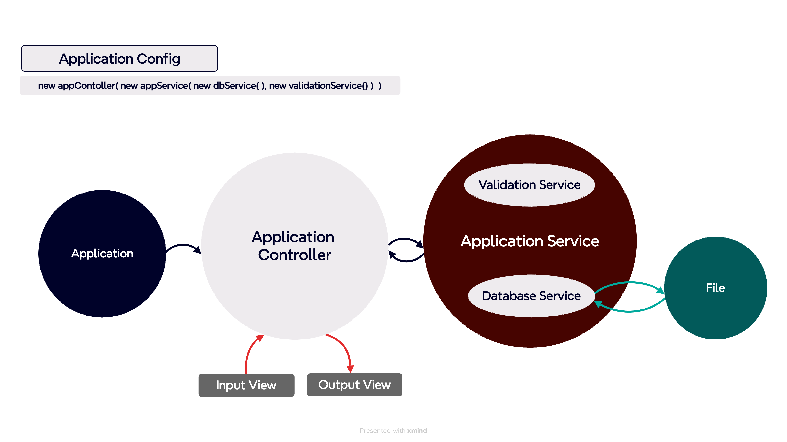

# ⚜️ 편의점 결제 시스템

# ⚜️ 기능 개요 
- 할인 혜택, 재고 상황에 대한 정보를 resources 폴더 하위의 products.md, promotions.md 파일에서 읽어와 DB에 저장
- **상품 구매 및 결제 시스템**
  - 사용자가 입력한 상품명, 가격, 수량을 바탕으로 최종 결제 금액 계산
  - 총 구매 금액에 프로모션과 멤버십 할인 포함
- **재고 관리**
  - 재고 수량을 고려해 결제 가능 여부 확인
- **프로모션 할인**
  - 프로모션 기간에만 적용 가능
  - 프로모션이 진행 중일 경우, 프로모션 재고를 우선 탐색
  - 프로모션 재고가 부족할 경우, 일반 재고에서 차감
  - 혜택을 받을 수 있는 상품이라면 추가로 수량을 구매할 것인지 의사 묻기
- **멤버십 할인**
  - 회원은 프로모션 미적용 금액의 30% 할인
  - 최대 8,000원까지 가능

# ⚜️ 예외 처리
## [ 파일 읽기 + 정보 반환 ]
- [x] resource 패키지 내부에 있는 파일이 아닌 경우 ⬅︎ 임의로 추가한 기능
- [x] 파일 이름이 잘못 입력되었을 경우 ⬅︎ 임의로 추가한 기능 

## [ 파일 데이터 DB에 초기 세팅 ]
- [x] 파일 속 데이터가 잘못 입력되어 있는 경우( ex. 상품 가격을 저장하는 곳에 문자가 입력되어 있는 경우 ) ⬅︎ 임의로 추가한 기능 

## [ 입력 ]
- [x] 구매 상품/수량 형식이 올바르지 않을 경우( `[ERROR] 올바르지 않은 형식으로 입력했습니다. 다시 입력해 주세요.` )
  - 대괄호( [, ] ), 쉼표(,), 하이픈(-) 등 입력 요구사항을 정확히 지켜야 정상적으로 작동 ⬅︎ 임의로 지정한 제한
- [x] 존재하지 않는 상품을 입력한 경우( `[ERROR] 존재하지 않는 상품입니다. 다시 입력해 주세요.` )
- [x] 구매 수량이 재고 수량을 초과한 경우( `[ERROR] 재고 수량을 초과하여 구매할 수 없습니다. 다시 입력해 주세요.` )
- [x] 기타 잘못된 입력( `[ERROR] 잘못된 입력입니다. 다시 입력해 주세요.` )
  - Y/N 가 아닌 다른 문자 입력한 경우(yes, no는 대소문자 관계 없이 정상 입력) ⬅︎ 임의로 지정한 제한
  - 공백을 입력한 경우 ⬅︎ 임의로 지정한 제한

# ⚜️ 기능 목록
### 상세 기능 및 작동 순서
## [ 파일 읽기 + 정보 반환 ]
- [x] 할인 혜택 정보, 재고 상황 정보를 불러오는 메서드를 나누어 작성한다.
- [x] 파일의 경로를 enum 객체를 활용해 얻는다.
- [x] 첫 번째 줄은 헤더이므로 삭제한다.
- [x] 정보를 행 단위로 읽어 List<String> 형태로 저장해 반환한다.

## [ 파일 데이터 DB에 초기 세팅 ]
- [x] config 패키지 하위에 DataInitialSetUp 클래스를 만들고, FileReader를 통해 읽어온 데이터를 products, promotions 각각 나누어 파싱하는 메서드를 만든다.
- [x] 파싱한 정보는 줄 단위로 각각 Product, Promotion 객체로 만든다.
- [x] 상품의 전체 정보를 담고 있는(만들어진 객체를 모두 모아 리스트 형태로 저장) ProductsRepository, PromotionsRepository 객체를 반환한다.
- [x] ProductsRepository, PromotionsRepository는 DB의 역할을 대신한다. 

## [ 상품 정보 ]
- [x] 인스턴스 변수 : 상품명, 가격, 재고, 프로모션 종류( 없을 경우 null 저장 )
- [x] 초기 정보로 DB 만들 시, 입력 값의 자료형이 맞지 않는 항목은 객체로 생성하지 않는다.

## [ 프로모션 정보 ]
- [x] 인스턴스 변수 : 상품명, 필요한 구매 수량, 무료 제공 수량, 시작일, 종료일
- [x] 초기 정보로 DB 만들 시, 프로모션이 종료된 것 또는 입력 값의 자료형이 맞지 않는 항목은 객체로 생성하지 않는다.

## [ 입력값 유효성 검증 및 데이터 처리 서비스 ]
- [x] appService 객체에 validationService, dbService 객체를 주입한다.
- [x] inputView를 통해 입력 받고, appService 객체에서 각각의 두 서비스 객체를 이용해 유효성 검증을 진행한다.
- [x] 아래의 경우, 해당 단계부터 입력을 다시 받는다.
  - 대괄호( [, ] ), 쉼표(,), 하이픈(-) 등 입력 요구사항을 정확히 지키지 않은 경우
  - 존재하지 않는 상품을 입력한 경우
  - 구매 수량이 재고 수량을 초과한 경우
  - Y/N 가 아닌 다른 문자 입력한 경우
  - 공백을 입력한 경우
- [x] 예외가 발생하지 않았다면, 입력 값을 이용 가능한 상태로 처리하여 반환한다.
- [x] 구매 희망 물품 정보(상품명, 수량)와 멤버십 정보를 하나의 객체로 만들어 반환한다.

## [ 결제 시스템 ]
- [ ] 상품 구매 처리 : 구매 요청을 처리한다.
- [ ] 재고 검증 및 업데이트 : 해당 상품의 재고를 차감한다. 이때, 재고는 최신 상태를 유지한다.
- [ ] 프로모션 적용 : 프로모션이 가능한 상품에 대해 수량을 계산하여 적용하고, 프로모션 혜택을 제공한다.
  - 프로모션 적용 상품이지만 재고가 부족하다면, 일반 재고를 사용한다.
  - 프로모션 기간 중이라면 프로모션 재고를 우선적으로 차감한다.
- [ ] 멤버십 할인 적용 : 프로모션 혜택을 받은 후, 최종 금액에 대해 멤버십 할인을 적용한다.
  - 멤버십 할인 적용 시, 프로모션 혜택을 받지 않은 금액의 30%를 할인한다.
- [ ] 결제 금액 계산 : 최종 구매 금액을 계산하고 출력한다.
- [ ] 영수증 출력 : 구매 내역, 증정 상품, 할인 내역을 포함한 영수증을 출력한다.

# ⚜️ 테스트
## [ 파일 읽기 + 정보 반환 ]
- [x] 정상 작동 테스트
  - 확장자 포함한 파일명
  - 확장자 포함하지 않는 파일명
- [x] 예외 테스트
  - resource 패키지에 포함되지 않은 파일
  - 파일 입력 오류

## [ 파일 데이터 DB에 초기 세팅 ]
- [x] 기간이 종료된 프로모션이 있을 경우, DB 속 프로모션 테이블은 해당 프로모션을 포함하지 않는다. 
- [x] 정수로 변환 불가능한 문자가 수량, 가격 등 정수로 사용되어야 하는 항목에 있을 경우는 객체를 생성하지 않는다. 

## [ 데이터베이스 서비스 ]
- [x] 정상 작동 테스트
  - 전체 상품 정보
  - 전체 프로모션 정보
  - 전체 상품명 정보
  - 특정 상품명에 해당하는 정보

## [ 유효성 검증 서비스 ]
- [x] 정상 작동 테스트
  - 입력 형식(, -, [, ])이 정확히 맞을 경우
  - 사용자의 의사를 묻는 대답에 대해 Y/y/yes는 true, N/n/No는 false 반환( 대소문자 상관 없이 )
- [x] 예외 테스트
  - 입력 형식이 맞지 않을 경우
  - 존재하지 않는 상품 압력한 경우
  - 구매 수량이 재고 수량을 초과한 경우
  - 공백 입력한 경우
  - 사용자의 의사를 묻는 대답에 대해 Y/y, N/n가 아닌 입력